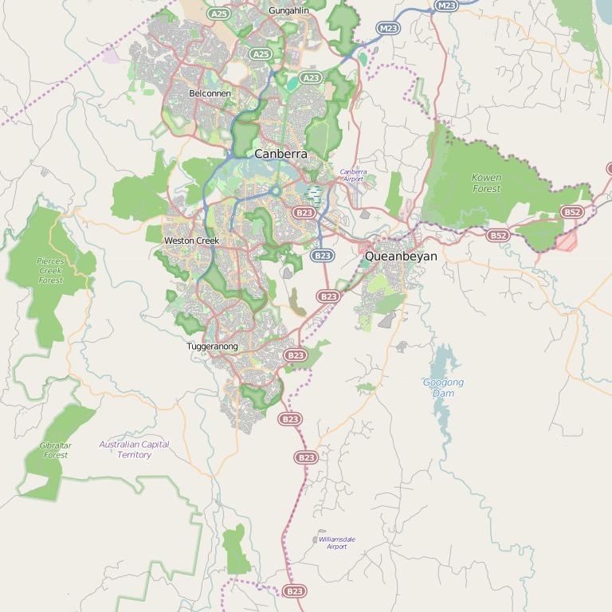
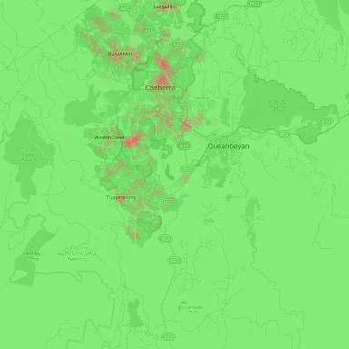

# COMP1040 Assignment 2
Semester 2, 2016

This `README.md` document describes the assignment and method of assessment.
Please read through the entire document carefully.

_This assignment is worth **20%** of your course grade.
It is due at 11:59pm on **Friday, 19 August 2016**._

## Overview

In this assignment you will be developing a rudimentary system for
visualising traffic incidents in the Canberra region. You will do this
by parsing tweets from the *ACTPol_Traffic* twitter account to extract
the location (street and suburb) for incidents reported in each tweet.
You will then plot these locations on a map of Canberra such as the
one shown below. All data and starter code is provided.

## Getting and Submitting the Assignment

The assignment is entirely managed from within the School's GitLab server.
You will fork and checkout the assignment to work on it and then commit
your changes and push them back to the GitLab server to submit your solutions.
You should push back often. The latest version of your code available at
the due date will be considered as your assignment submission.

### Forking and Cloning the Data and Code

Before working on the assignment you must first _fork_ a copy from the COMP1040
account here: <https://gitlab.cecs.anu.edu.au/comp1040/comp1040-2016-a2>

Once you have forked the project, you will need to clone the project repository
using PyCharm IDE as you did in the first assignment.

**Important**: Make sure your fork of the assignment is _private_ before you
start committing work to it, otherwise everyone using GitLab will be able to see
your work. This should happen automatically but it is always good practice to
check. You can set a Project to private via the GitLab interface:

1. Go to the version of the assignment that you've forked from your Profile page.
2. Click on the Gear drop-down box in the top right and choose "Edit Project".
3. Under "Visibility Level", select "Private".
4. Click on the "Save changes" button

### Description of the Data

This section describes how we obtained the data for the assignment. It is provided
for your information. **You do not need to implement the steps outlined in this section.**
All data is provided in the `data` directory.

The `ACTPol_Traffic` file was obtained by dumping tweets posted from the *ACTPol_Traffic*
Twitter account. We did this using the 'twitter-archiver' application, which is available
in the Python 'twitter' package, as follows:

    sudo easy_install twitter
    twitter-archiver -o ACTPol_Traffic

We repeat, this is for your information only. You do not need to execute the steps above.

The file has one tweet per line. The start of the line contains the following space-separated
fields, which are then followed by the tweet (until the end of the line)

1. Unique tweet identifier
2. Date
3. Time
4. Timezone (AEST)
5. Twitter account in angled brackets

There are two versions of the map of Canberra obtained from Open Street Map,
<http://www.openstreetmap.org/export#map=12/-35.3283/149.2155>. Associated
with each map is a text file indicating the latitude and longitude range
covered by the map. The format of the lat/lon files is:

    lat_max lat_min
    lon_min lon_max

Canberra street locations were obtained via Google's geocode API. The file
format includes the query address, returned address, latitude, longitude,
location type (from Google), and number of results found. The fields are
delimited by a vertical bar.

## Tasks

You are provided with:

- a map of Canberra (and longitude/latitude bounds on the map)
- a file containing street and suburb names and their locations
- a file of tweets obtained from the *ACTPol_Traffic* twitter account
- and starter Python code and test cases

You should complete the tasks listed below in the Python 3 programming
language. You are free to use additional Python libraries to complete
the task as long as they are bundled with the Anaconda 3
distribution. Each task is associated with a detailed GitLab issue
which you must close when completing the task. A break down of marks is
given next to each task.

### Part A. Text Processing (40%)
1. parse and normalise tweets                         (15%)
2. match tweets against some street names             (10%)
3. compute histogram of suburb mentions               (15%)
  + **Note:** the histogram could be slightly inaccurate since suburb can be same as street names

### Part B. Visualization (55%)
4. parse street locations from file                   (10%)
5. read and display the map                           (5%)
6. compute lat/long map coordinates (and test)        (15%)
7. animate tweet events on map                        (15%)
8. show heatmap of events such as shown below (bonus) (10%)

### Miscellaneous (5%)
8. demonstrated use of GitLab                         (5%)
  + inclusion of NOTES.md file
  + commit history and issue tracking

## Copying & Plagiarism

The ANU takes plagiarism (i.e., the unattributed copying of another's work) very
seriously (see [Academic Honesty & Plagiarism][AHP]).

While we fully expect you to discuss approaches to questions with your
classmates you must never copy a complete or partial solution from someone else
and claim it as your own.

Make sure the code you write is your own. If you do get help from
someone or somewhere on the web, you must make a note (e.g., in the
code comments or a NOTES.md file) as to the nature of that help.

[AHP]: http://www.anu.edu.au/students/program-administration/assessments-exams/academic-honesty-plagiarism